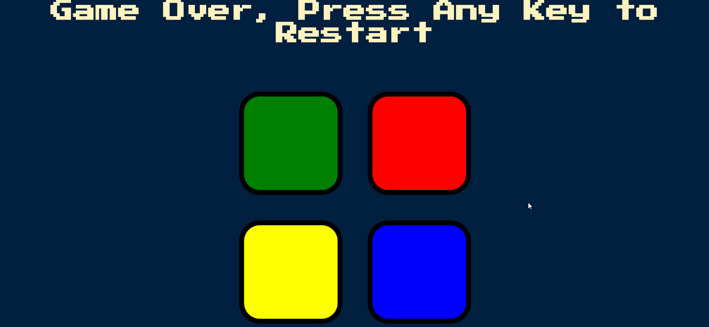

# Simon-Game
In the Simon-Game, users are shown a certain pattern of colors one at a time and must recreate that pattern from memory. As part of an online full-stack web development course, I recreated the Simon-Game using HTML, CSS, and jQuery. 

Demo: 

